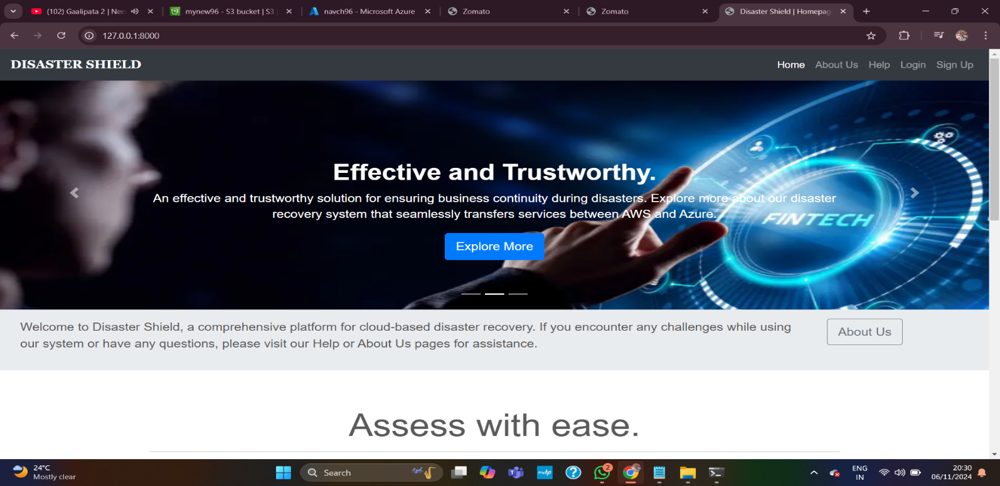
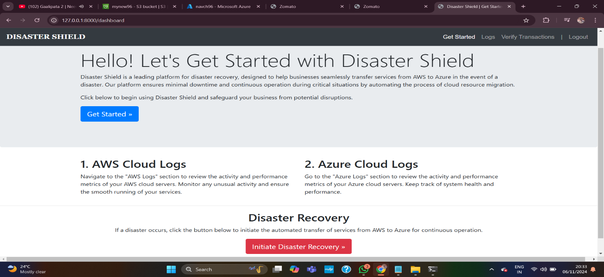
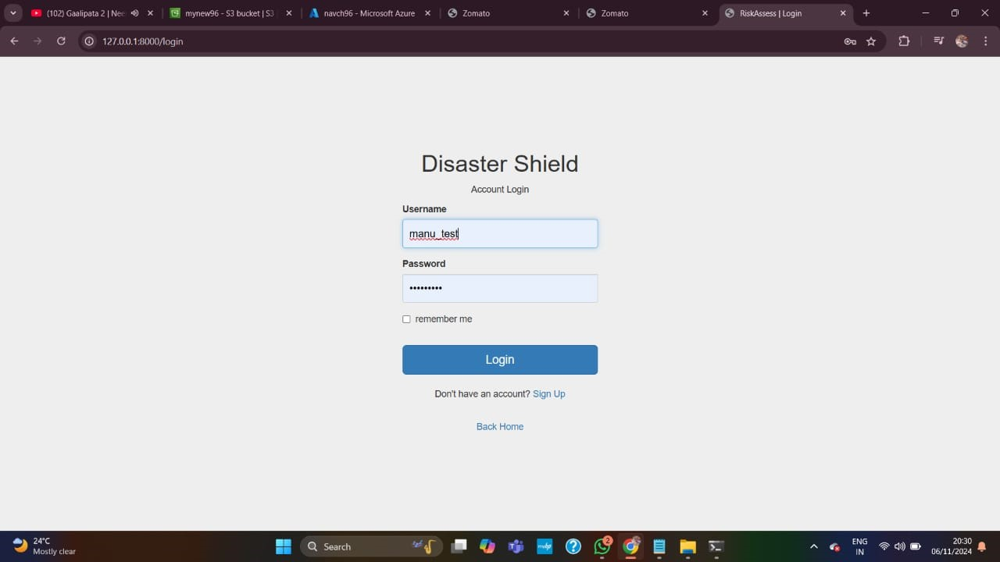
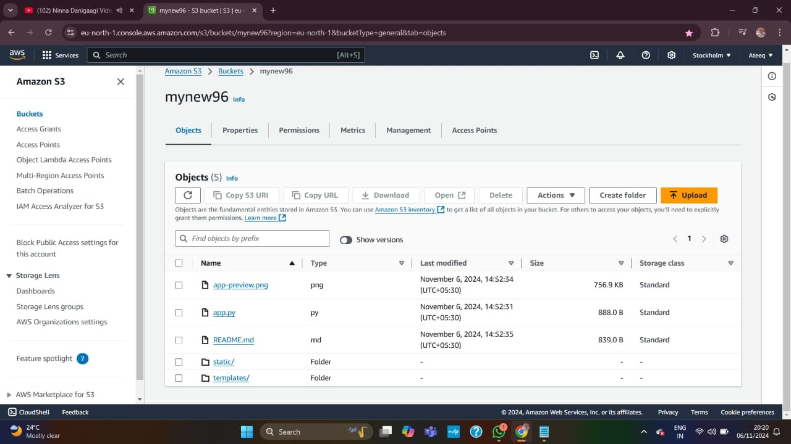

# Cloud Aggregator with Disaster Recovery

Overview

The Cloud Aggregator with Disaster Recovery (CAWDR) project addresses the critical challenges faced by organizations in managing and protecting cloud-based data. This solution provides a unified platform for integrating cloud services across multiple providers (AWS and Azure) and offers robust disaster recovery capabilities to ensure minimal downtime and data loss during disruptions.
________________________________________
# Features
•	Cross-Cloud Interoperability: Seamlessly integrates AWS and Azure cloud platforms for enhanced resource management.
•	Real-Time Data Replication: Continuous data synchronization at the block level to reduce potential data loss.
•	Automated Failover and Failback: Effortless transition between primary and backup environments during disasters.
•	Monitoring and Alerts: Real-time system health checks and alert mechanisms for proactive issue management.
•	User-Friendly Interface: Web-based dashboard for system configuration, monitoring, and control.
________________________________________
# Architecture
The system leverages a dual-cloud architecture, featuring:
•	Primary Environment: Hosted on AWS for normal operations.
•	Secondary Environment: Mirrored setup on Azure for disaster recovery.
•	Failover Controller: Automated traffic redirection during service disruptions.
•	Monitoring Layer: Tracks system health and performance in real-time.
________________________________________
# Languages Used
The project utilizes the following languages:
•	Python: Backend logic, API integration, and scripting.
•	HTML/CSS: User interface design.
•	JavaScript: Interactive front-end functionalities.
•	SQL: Database management for storing system configurations and logs.
________________________________________
# Requirements
Hardware
•	High-capacity storage systems for replication.
•	Secure networking equipment for inter-cloud communication.

Software
•	AWS CloudEndure or Azure Site Recovery for replication.
•	APIs for monitoring and logging.

Environment
•	Secure connectivity through VPN, AWS Direct Connect, or Azure ExpressRoute.
•	Containers for workload portability (Docker/Kubernetes support).
________________________________________
# Usage
1.	Access the web interface at http://localhost:5000.
2.	Configure AWS and Azure credentials under the Settings tab.
3.	Initiate data replication or failover tests via the Dashboard.
4.	Monitor real-time metrics and alerts for system health.
________________________________________
## App Preview

________________________________________
# Contributing
Contributions are welcome! Please follow these steps:
1.	Fork this repository.
2.	Create a feature branch.
3.	Commit your changes and submit a pull request.
________________________________________
# License
This project is licensed under the MIT License.
________________________________________
# Author
•	Edde Vinith Kumar Reddy

